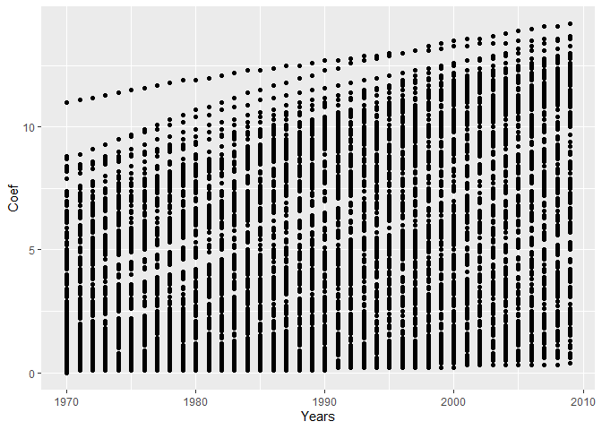
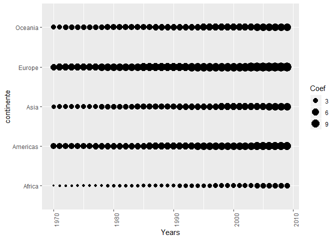
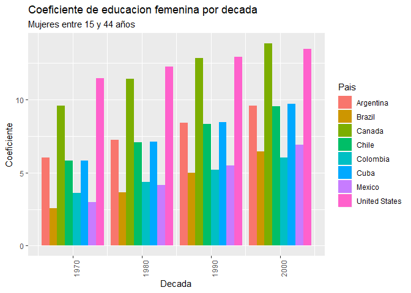
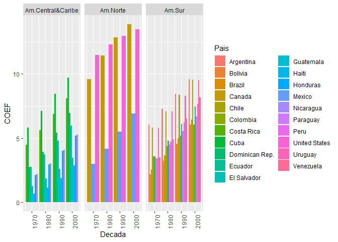
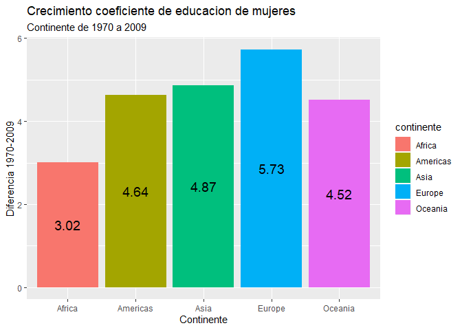

Clase GGPLOT
================
Sofia Santamarina y Manuel Zapico
11 de agosto de 2019

# GGPLOT

Despues de aprender a modificar los datos y las bases con **tidyverse**,
vamos a realizar graficos para ilustrar nuestros resultados.

Primero, vamos a la biblioteca a buscar nuestro *paquete*. Tambien
pedimos *tidyverse*, porque lo vamos a seguir usando.

``` r
library(tidyverse)
```

    ## Registered S3 method overwritten by 'rvest':
    ##   method            from
    ##   read_xml.response xml2

    ## -- Attaching packages --------------------------- tidyverse 1.2.1.9000 --

    ## v ggplot2 3.2.0       v purrr   0.3.2  
    ## v tibble  2.1.1       v dplyr   0.8.0.1
    ## v tidyr   0.8.3       v stringr 1.4.0  
    ## v readr   1.3.1       v forcats 0.4.0

    ## -- Conflicts ----------------------------------- tidyverse_conflicts() --
    ## x dplyr::filter() masks stats::filter()
    ## x dplyr::lag()    masks stats::lag()

``` r
library(ggplot2)
```

En este trabajo vamos a usar una base de datos del sitio *gapminder*.
Esta pagina web es muy util para obtener bases de datos ordenadas y con
datos sin demasiados errores.

Elegimos la base de datos “Años de escolarizacion de mujeres de 15 a
44”.

``` r
ESC_MUJERES <- read_delim("School_Women_15_44.csv", 
    ";", escape_double = FALSE, trim_ws = TRUE)
```

    ## Parsed with column specification:
    ## cols(
    ##   .default = col_double(),
    ##   Pais = col_character()
    ## )

    ## See spec(...) for full column specifications.

``` r
head(ESC_MUJERES)
```

    ## # A tibble: 6 x 41
    ##   Pais  `1970` `1971` `1972` `1973` `1974` `1975` `1976` `1977` `1978`
    ##   <chr>  <dbl>  <dbl>  <dbl>  <dbl>  <dbl>  <dbl>  <dbl>  <dbl>  <dbl>
    ## 1 Afgh~    0      0.1    0.1    0.1    0.1    0.1    0.1    0.1    0.1
    ## 2 Alba~    3.9    4      4.1    4.2    4.3    4.5    4.6    4.7    4.8
    ## 3 Alge~    0.6    0.6    0.6    0.7    0.7    0.8    0.8    0.9    0.9
    ## 4 Ango~    0.5    0.5    0.5    0.5    0.6    0.6    0.6    0.7    0.7
    ## 5 Anti~    7      7.1    7.2    7.4    7.5    7.7    7.8    8      8.1
    ## 6 Arge~    5.5    5.6    5.7    5.9    6      6.1    6.2    6.3    6.5
    ## # ... with 31 more variables: `1979` <dbl>, `1980` <dbl>, `1981` <dbl>,
    ## #   `1982` <dbl>, `1983` <dbl>, `1984` <dbl>, `1985` <dbl>, `1986` <dbl>,
    ## #   `1987` <dbl>, `1988` <dbl>, `1989` <dbl>, `1990` <dbl>, `1991` <dbl>,
    ## #   `1992` <dbl>, `1993` <dbl>, `1994` <dbl>, `1995` <dbl>, `1996` <dbl>,
    ## #   `1997` <dbl>, `1998` <dbl>, `1999` <dbl>, `2000` <dbl>, `2001` <dbl>,
    ## #   `2002` <dbl>, `2003` <dbl>, `2004` <dbl>, `2005` <dbl>, `2006` <dbl>,
    ## #   `2007` <dbl>, `2008` <dbl>, `2009` <dbl>

Tenemos los paises y los indices de mujeres de 15 a 44 años que estan
escolarizadas, dividido por año. Para tener mas informacion, vamos a
unirlo al dataset de “continentes”. Para eso, usamos un **join**.

Primero traemos el dataset:

``` r
continente <- read_delim("continente.csv", 
    ";", escape_double = FALSE, trim_ws = TRUE)
```

    ## Parsed with column specification:
    ## cols(
    ##   Pais = col_character(),
    ##   continente = col_character()
    ## )

``` r
head(continente)
```

    ## # A tibble: 6 x 2
    ##   Pais                continente
    ##   <chr>               <chr>     
    ## 1 Afghanistan         Asia      
    ## 2 Albania             Europe    
    ## 3 Algeria             Africa    
    ## 4 Angola              Africa    
    ## 5 Antigua and Barbuda Americas  
    ## 6 Argentina           Americas

Ahora lo unimos con nuestra base de datos:

``` r
ESC_MUJERES <- left_join(ESC_MUJERES, continente)
```

    ## Joining, by = "Pais"

``` r
head(ESC_MUJERES)
```

    ## # A tibble: 6 x 42
    ##   Pais  `1970` `1971` `1972` `1973` `1974` `1975` `1976` `1977` `1978`
    ##   <chr>  <dbl>  <dbl>  <dbl>  <dbl>  <dbl>  <dbl>  <dbl>  <dbl>  <dbl>
    ## 1 Afgh~    0      0.1    0.1    0.1    0.1    0.1    0.1    0.1    0.1
    ## 2 Alba~    3.9    4      4.1    4.2    4.3    4.5    4.6    4.7    4.8
    ## 3 Alge~    0.6    0.6    0.6    0.7    0.7    0.8    0.8    0.9    0.9
    ## 4 Ango~    0.5    0.5    0.5    0.5    0.6    0.6    0.6    0.7    0.7
    ## 5 Anti~    7      7.1    7.2    7.4    7.5    7.7    7.8    8      8.1
    ## 6 Arge~    5.5    5.6    5.7    5.9    6      6.1    6.2    6.3    6.5
    ## # ... with 32 more variables: `1979` <dbl>, `1980` <dbl>, `1981` <dbl>,
    ## #   `1982` <dbl>, `1983` <dbl>, `1984` <dbl>, `1985` <dbl>, `1986` <dbl>,
    ## #   `1987` <dbl>, `1988` <dbl>, `1989` <dbl>, `1990` <dbl>, `1991` <dbl>,
    ## #   `1992` <dbl>, `1993` <dbl>, `1994` <dbl>, `1995` <dbl>, `1996` <dbl>,
    ## #   `1997` <dbl>, `1998` <dbl>, `1999` <dbl>, `2000` <dbl>, `2001` <dbl>,
    ## #   `2002` <dbl>, `2003` <dbl>, `2004` <dbl>, `2005` <dbl>, `2006` <dbl>,
    ## #   `2007` <dbl>, `2008` <dbl>, `2009` <dbl>, continente <chr>

Listo\! Ya tenemos la base de datos que vamos a usar.

## Graficos basicos

Empecemos con los denominados **geom**. Vamos a hacer graficos de
puntos, barras, lineas, etc.

Primero, tenemos que solucionar un problema (hacer otra **limpieza**).En
este tipo de graficos, **ggplot** nos pide que le demos *las columnas*.
El problema que tenemos con esta base es que cada año es una columna,
por lo que no podriamos graficar toda la serie de años.

Que hacemos?

Tenemos que hacer un agrupamiento ( **gather** ) de los datos. Una vez
mas, si no sabemos como hacerlo, *googleamos* o vamos al Stack Overflow.

A continuacion creamos la nueva base para los **geom**, que me agrupe
por año (
**Years**).

``` r
GEOM_MUJERES <- gather(ESC_MUJERES,"Years", "Coef", -Pais, -continente) %>% 
                  arrange(Pais)

GEOM_MUJERES <- GEOM_MUJERES %>% drop_na(continente)

GEOM_MUJERES$Years <- as.numeric(GEOM_MUJERES$Years)

head(GEOM_MUJERES)
```

    ## # A tibble: 6 x 4
    ##   Pais        continente Years  Coef
    ##   <chr>       <chr>      <dbl> <dbl>
    ## 1 Afghanistan Asia        1970   0  
    ## 2 Afghanistan Asia        1971   0.1
    ## 3 Afghanistan Asia        1972   0.1
    ## 4 Afghanistan Asia        1973   0.1
    ## 5 Afghanistan Asia        1974   0.1
    ## 6 Afghanistan Asia        1975   0.1

Finalmente, como es otro dato que nos puede servir, vamos a dividir por
**decada** la base de datos. Como hacemos? Con **case\_when** vamos a
poder asignar un valor a partir de otro.

``` r
GEOM_MUJERES <- GEOM_MUJERES %>% 
                    mutate(Decada = case_when(Years <1980 ~ 1970,
                                               Years <1990 ~ 1980,
                                               Years <2000 ~ 1990,
                                               Years <2010 ~ 2000))
```

Ahora si, con una columna con los años, vamos a poder graficar.Empezamos
con un clasico: el grafico de puntos. De que manera cambia el
coeficiente de escolarizacion segun los años. Veamos:

### Grafico de puntos

IMPORTANTE: primero, escribimos la funcion ( **ggplot**). Luego, ponemos
la base que vamos a usar ( **GEOM\_MUJERES**) y despues tenemos que
poner el eje “x” y el eje “y” dentro de **aes**, como se muestra a
continuacion. *Aes* significa *AESTHETICS*, y comprende el “diseño” del
grafico que vamos a crear. Luego, agregamos un “+” y le especificamos el
tipo de grafico. En este caso, le vamos a pedir un grafico de puntos.

``` r
ggplot(GEOM_MUJERES, aes(x = Years, y= Coef))+
  geom_point()
```

<!-- -->

Es claro el grafico?? La verdad que no\! Vamos a ver que tal vez
tendriamos que usar otro tipo de grafico para estos datos. Sin embargo,
podemos notar algo interesante: parece haber una brecha muy grande entre
un pais y el resto en las primeras decadas. Brecha que con el tiempo va
cerrandose.

Podemos tratar de hacer algo con esto? Si, podemos asignarle color para
darle un poco de sentido al grafico\!\! Vamos a dividirlos por
**continente**. Por pais no conviene, porque son tantos que la
diferencia de los colores no seria suficiente (volveremos a esto mas
adelante).

Entonces, dentro de **aes**, ponemos que queremos que los continentes
tengan colores. Por ultimo, los años tampoco se leen. Eso podemos
modificarlo de la forma en que queramos. En este momento, vamos a
pedirle que aparezcan de forma vertical los años.

``` r
ggplot(GEOM_MUJERES, aes(x = Years, y= Coef, color = continente))+
  geom_point()+
  theme(axis.text.x = element_text(angle = 90))
```

<!-- -->

Ahi podemos ver que hay dos paises **americanos** que estan por encima
del resto. Luego, la mayoria de paises son europeos. En el medio vuelve
a aparecer America; los ultimos valores son Africa y Asia.

Podemos darle **transparencia** para ver un poco mejor los resultados:

``` r
ggplot(GEOM_MUJERES, aes(x = Years, y= Coef, color = continente))+
  geom_point(alpha = 0.3)+
  theme(axis.text.x = element_text(angle = 90))
```

<!-- -->

Vamos a ver dos cosas mas que podemos hacer con el grafico de puntos.
Queremos los coeficientes de escolarizacion para cada continente. Para
eso, sacamos un promedio ( **mean**) por continente por año.

``` r
CONTINENTES_COEF <- GEOM_MUJERES %>% 
                    group_by(continente, Years) %>% 
                    summarise(mean(Coef))

#Cambiemos el nombre de la media de Coeficientes

colnames(CONTINENTES_COEF)[colnames(CONTINENTES_COEF)=="mean(Coef)"] <- "Coef"

head(CONTINENTES_COEF)
```

    ## # A tibble: 6 x 3
    ## # Groups:   continente [1]
    ##   continente Years  Coef
    ##   <chr>      <dbl> <dbl>
    ## 1 Africa      1970 0.739
    ## 2 Africa      1971 0.778
    ## 3 Africa      1972 0.818
    ## 4 Africa      1973 0.855
    ## 5 Africa      1974 0.904
    ## 6 Africa      1975 0.953

Con estos datos, pedimos que el *punto* cambie de tamaño segun los datos
del coeficiente de escolarizacion.

``` r
ggplot(CONTINENTES_COEF, aes(x = Years, y= continente, size = Coef))+
  geom_point()+
  theme(axis.text.x = element_text(angle = 90))
```

<!-- -->

Como podemos ver, Africa y Asia son los paises con menor coeficiente en
todos los años.

Como podemos verlo mas claramente. Agreguemos color\!

El color es un capitulo aparte en R. Es cuestion de buscar en internet
las paletas de colores que mejor se adapten a nuestro trabajo. Un buen
sitio es el siguiente:

<http://www.cookbook-r.com/Graphs/Colors_(ggplot2)/>

Usamos la paleta **spectral**, que nos va a servir para hacer un mapa de
calor en el que el *azul* sean los datos mas bajos y el *rojo*
represente a los mas
altos.

``` r
ggplot(CONTINENTES_COEF, aes(x = Years, y= continente, color = Coef, size = Coef))+
  geom_point()+
  theme(axis.text.x = element_text(angle = 90))+
  scale_color_distiller(palette = "Spectral")
```

<!-- -->

Con esta paleta podemos apreciar algunas cosas: Africa es claramente el
pais con mas baja educacion para mujeres de 15 a 44 años. Europa es el
mas adelantado en esta tematica. Ademas, los colores nos permiten hacer
comparaciones mas facilmente: Africa recien llega a los valores que Asia
tenia en la decada de los 70. Asia y Oceania parecen crecer de manera
similar. America presenta valores parecidos a los que Europa tenia a
principios de los 90.

### Barras

Hagamos un grafico de barras. Para eso, vamos a usar algunos paises de
**America** para ver sus diferencias. Elijamos los siguientes: Estados
Unidos, Canada, Mexico, Cuba, Colombia, Brasil, Chile y Argentina.
Usamos el **filter** y la condicion “|” que significa “o”.

``` r
AMERICA <- GEOM_MUJERES %>% 
                          filter(Pais == "United States" |
                                   Pais == "Canada" |
                                   Pais == "Mexico"|
                                   Pais == "Cuba" |
                                   Pais == "Colombia" |
                                   Pais == "Brazil" |
                                   Pais == "Chile" |
                                   Pais == "Argentina")
AMERICA <- select(AMERICA, -continente)
```

El primer grafico de barras que vamos a hacer es general. Vamos a ver el
crecimiento por decada, para tener numeros mas claros. Lo complejo va a
ser el armado: no vamos a contruir una nueva base de datos, sino que
vamos a modificar la base **AMERICA**, para poder hacer nuestro grafico.
Esto lo hacemos con el **pipe** ( %\>% )

``` r
AMERICA %>% 
  group_by(Pais, Decada) %>% 
  summarise(COEF = mean(Coef)) %>%  
  ggplot()+
  geom_bar(aes(x = Decada, weight = COEF, fill = Pais))+
   theme(axis.text.x = element_text(angle = 90))
```

<!-- -->

Ahi esta\!\! Pero queremos las columnas desagregadas por pais.
Simplemente, hacemos un *dodge*. Y tambien vamos a ponerle el titulo y
los nombres a los ejes con **labels**.

``` r
AMERICA %>% 
  group_by(Pais, Decada) %>% 
  summarise(COEF = mean(Coef)) %>%  
  ggplot()+
  geom_col(aes(x = Decada, y = COEF, fill = Pais), position ='dodge')+
  theme(axis.text.x = element_text(angle = 90))+
  labs(title = "Coeficiente de educacion femenina por decada",
       subtitle = "Mujeres entre 15 y 44 años",
       x = "Decada",
       y= "Coeficiente")
```

<!-- -->

Podemos ver que Canada y Estados Unidos superan a los paises de America
Latina. Con el tiempo, Canada supera a EEUU. Argentina, Cuba y Chile
crecen mas o menos al mismo ritmo. Respecto a Mexico, Brazil y Colombia,
estan por debajo del resto y, con las decadas, Mexico y Brasil superan a
Colombia.

\#\#ELIJAN OTROS 5 PAISES Y HAGAN LO MISMO QUE HICIMOS

``` r
#EJERCICIO - FILTRAR LOS DATOS
```

``` r
#EJERCICIO - GRAFICAR!
```

### USAMOS case.when

Vayamos un paso atras y hagamos una comparacion entre paises de America.

``` r
AMERICA_CONT <- GEOM_MUJERES %>% 
                          filter(Pais == "United States" |
                                   Pais == "Canada" |
                                   Pais == "Mexico"|
                                   Pais == "Cuba" |
                                   Pais == "Dominican Rep."|
                                   Pais == "Haiti" |
                                   Pais == "Guatemala"|
                                   Pais == "El Salvador"|
                                   Pais == "Honduras"|
                                   Pais == "Costa Rica" |
                                   Pais == "Nicaragua"|
                                   Pais == "Venezuela"|
                                   Pais == "Ecuador"|
                                   Pais == "Peru"|
                                   Pais == "Bolivia"|
                                   Pais == "Paraguay"|
                                   Pais == "Uruguay"|
                                   Pais == "Colombia" |
                                   Pais == "Brazil" |
                                   Pais == "Chile" |
                                   Pais == "Argentina")

AMERICA_CONT <- select(AMERICA_CONT, -continente)

AMERICA_CONT <- AMERICA_CONT %>% 
                    mutate(Region = case_when(Pais == "United States"~ "Am.Norte",
                                              Pais == "Canada"~ "Am.Norte",
                                              Pais == "Mexico"~ "Am.Norte",
                                              Pais == "Cuba"~ "Am.Central&Caribe",
                                              Pais == "Dominican Rep."~ "Am.Central&Caribe",
                                              Pais == "Haiti"~ "Am.Central&Caribe",
                                              Pais == "Guatemala"~ "Am.Central&Caribe",
                                              Pais == "El Salvador"~ "Am.Central&Caribe",
                                              Pais == "Honduras"~ "Am.Central&Caribe",
                                              Pais == "Costa Rica"~ "Am.Central&Caribe",
                                              Pais == "Nicaragua"~ "Am.Central&Caribe",
                                              Pais == "Venezuela"~ "Am.Sur",
                                              Pais == "Ecuador"~ "Am.Sur",
                                              Pais == "Peru"~ "Am.Sur",
                                              Pais == "Bolivia"~ "Am.Sur",
                                              Pais == "Paraguay"~ "Am.Sur",
                                              Pais == "Uruguay"~ "Am.Sur",
                                              Pais == "Colombia"~ "Am.Sur",
                                              Pais == "Brazil"~ "Am.Sur",
                                              Pais == "Chile"~ "Am.Sur",
                                              Pais == "Argentina"~ "Am.Sur")
                    )

head(AMERICA_CONT)
```

    ## # A tibble: 6 x 5
    ##   Pais      Years  Coef Decada Region
    ##   <chr>     <dbl> <dbl>  <dbl> <chr> 
    ## 1 Argentina  1970   5.5   1970 Am.Sur
    ## 2 Argentina  1971   5.6   1970 Am.Sur
    ## 3 Argentina  1972   5.7   1970 Am.Sur
    ## 4 Argentina  1973   5.9   1970 Am.Sur
    ## 5 Argentina  1974   6     1970 Am.Sur
    ## 6 Argentina  1975   6.1   1970 Am.Sur

Vamos con el grafico de barras. Pero esta vez, vamos a dividirlo por
*subcontinente* con **facet\_wrAp**.

``` r
AMERICA_CONT %>% 
  group_by(Pais, Decada, Region) %>% 
  summarise(COEF = mean(Coef)) %>% 
  ggplot()+
  geom_col(aes(x = Decada, y = COEF, fill = Pais), position ='dodge')+
  facet_wrap(~ Region)+
  theme(axis.text.x = element_text(angle = 90))
```

<!-- -->

Tambien podemos agrega lineas de referencia a nuestro grafico. Por
ejemplo, a continuacion trazamos el promedio total del coeficiente en
nuestro continente. Veremos que paises pasan esa media y en que periodo.

``` r
AMERICA_CONT %>% 
  summarise(mean(Coef))
```

    ## # A tibble: 1 x 1
    ##   `mean(Coef)`
    ##          <dbl>
    ## 1         5.80

``` r
AMERICA_CONT %>% 
  group_by(Pais, Decada, Region) %>% 
  summarise(COEF = mean(Coef)) %>% 
  ggplot()+
  geom_col(aes(x = Decada, y = COEF, fill = Pais), position ='dodge')+
  geom_hline(yintercept=5.802143, linetype="dashed", color = "red")+
  facet_wrap(~ Region)+
  theme(axis.text.x = element_text(angle = 90))
```

<!-- -->

En Centro America y el Caribe, Costa Rica y Cuba superan la media (ya en
los 80). Al final, tambien supera por poco Guatemala. En America del
Norte, EEUU y Canada siempre superaron la media “historica”; Mexico
recien la paso en la ultima decada. En Sudamerica, Argentina y Chile
superan la media desde los 70. En esta decada, todos los paises alcanzan
el promedio “historico”.

### Lineas

Otro de los graficos basicos que podemos hacer es el grafico de
**lineas**. Hagamos una visualizacion del crecimiento en diez años de
los coeficientes. Vamos a ver como cambia por decada. Para eso, primero
hacemos una seleccion de un año por decada. Lo vamos a ver por
continente.

``` r
INDICE_CRECIMIENTO <- GEOM_MUJERES %>% 
                          filter(Years==1970 |
                                   Years == 1980|
                                   Years == 1990 |
                                   Years == 2000 |
                                   Years == 2009) %>% 
                          group_by(continente, Years) %>% 
                          summarise(COEF = mean(Coef))
head(INDICE_CRECIMIENTO)                          
```

    ## # A tibble: 6 x 3
    ## # Groups:   continente [2]
    ##   continente Years  COEF
    ##   <chr>      <dbl> <dbl>
    ## 1 Africa      1970 0.739
    ## 2 Africa      1980 1.2  
    ## 3 Africa      1990 1.89 
    ## 4 Africa      2000 2.78 
    ## 5 Africa      2009 3.75 
    ## 6 Americas    1970 3.94

``` r
ggplot(INDICE_CRECIMIENTO, aes(x=Years, y=COEF, group=continente, colour=continente)) +
    geom_line() +
    geom_point()+
    theme(legend.position="bottom")+
    labs(title = "Crecimiento coeficiente educacion femenina",
       subtitle = "Cada 10 años por continente",
       x = "Decada",
       y= "Coeficiente")
```

<!-- -->

Finalmente, hagamos un grafico sencillo que muestre el nivel del
crecimiento. Cual tuvo el cambio mas grande desde 1970? Sera Asia? Vamos
a tener que usar muchas de las cosas que vimos en **tidyverse**.

``` r
NIVEL_CRECIMIENTO <- INDICE_CRECIMIENTO %>% 
                      filter(Years == 1970 |
                               Years == 2009) %>% 
                      spread(key = Years, value = COEF) %>% 
                      select(continente, 3, 2)

colnames(NIVEL_CRECIMIENTO)[colnames(NIVEL_CRECIMIENTO)=="2009"] <- "Actual"
colnames(NIVEL_CRECIMIENTO)[colnames(NIVEL_CRECIMIENTO)=="1970"] <- "Inicio"

NIVEL_CRECIMIENTO <- NIVEL_CRECIMIENTO %>% 
                          mutate(Nivel = Actual - Inicio)

NIVEL_CRECIMIENTO <- NIVEL_CRECIMIENTO %>% mutate(Round = 
                                                    round(Nivel, 2))
```

``` r
ggplot(NIVEL_CRECIMIENTO, aes(x = continente, y = Nivel, fill = continente, label = Round)) +
  geom_bar(stat = "identity") +
  geom_text(size = 5, position = position_stack(vjust = 0.5))+
  labs(title ="Crecimiento coeficiente de educacion de mujeres",
        subtitle = "Continente de 1970 a 2009", 
        x = "Continente",
        y = "Diferencia 1970-2009")
```

<!-- -->

Como puede verse, el mayor crecimiento de educacion para mujeres de 15 a
44 años desde 1970 a 2009 fue en Europa. Sin embargo, Asia esta en el
segundo puesto.

**TAREA**: calcular este crecimiento por decada. Es decir, la diferencia
entre el crecimiento de 1970 y 1980, 1980 y 1990, etc. Hay cambios por
periodo? Otro aspecto interesante es dividir America en “America
Latina/EEUU y Canada” y Asia en “Medio Oriente/Asia (China, India,
Tigres Asiaticos)”.
