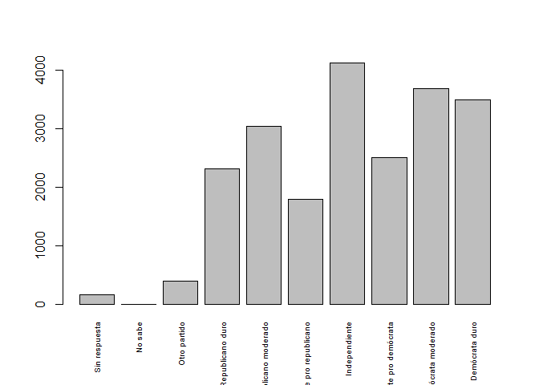

DataSoc - Clase 3
================
Arrancando con Datos
Agosto de 2019

## Presentación del Dataset

Recordemos siempre antes de comenzar con R debemos convocar a los
paquetes que contienen las funciones necesarias para el manipuleo de
datos con el comando **library()**.

``` r
# Llamamos a los paquetes 
library(datos)
```

    ## Warning: package 'datos' was built under R version 3.6.1

``` r
library(tidyverse)
```

    ## Registered S3 method overwritten by 'rvest':
    ##   method            from
    ##   read_xml.response xml2

    ## -- Attaching packages ------------------------------------ tidyverse 1.2.1.9000 --

    ## v ggplot2 3.2.0       v purrr   0.3.2  
    ## v tibble  2.1.1       v dplyr   0.8.0.1
    ## v tidyr   0.8.3       v stringr 1.4.0  
    ## v readr   1.3.1       v forcats 0.4.0

    ## -- Conflicts -------------------------------------------- tidyverse_conflicts() --
    ## x dplyr::filter() masks stats::filter()
    ## x dplyr::lag()    masks stats::lag()

``` r
# Descargamos el dataset "encuesta"
encuesta <- datos::encuesta
```

Con esto el conjunto de datos queda cargado en memoria. Si en lugar de
tomar un conjunto de datos de una librería de R lo tuviésemos que leer
desde un archivo `csv` deberíamos utilizar la función **read\_csv()**.

``` r
encuesta <- read_csv(file = "encuesta.csv")
```

A través de deste comando creamos el dataframe. Podemos ver el contenido
del mismo escribiendo el nombre del *df*.

``` r
encuesta
```

    ## # A tibble: 21,483 x 9
    ##     anio estado_civil  edad raza  ingreso partido religion denominacion
    ##    <int> <fct>        <int> <fct> <fct>   <fct>   <fct>    <fct>       
    ##  1  2000 Nunca se ha~    26 Blan~ 8000 -~ Indepe~ Protest~ Bautistas d~
    ##  2  2000 Divorciado      48 Blan~ 8000 -~ Republ~ Protest~ Bautista, n~
    ##  3  2000 Viudo           67 Blan~ No apl~ Indepe~ Protest~ No denomina~
    ##  4  2000 Nunca se ha~    39 Blan~ No apl~ Indepe~ Cristia~ No aplica   
    ##  5  2000 Divorciado      25 Blan~ No apl~ Demócr~ Ninguna  No aplica   
    ##  6  2000 Casado          25 Blan~ 20000 ~ Demócr~ Protest~ Bautistas d~
    ##  7  2000 Nunca se ha~    36 Blan~ 25000 ~ Republ~ Cristia~ No aplica   
    ##  8  2000 Divorciado      44 Blan~ 7000 -~ Indepe~ Protest~ Sínodo lute~
    ##  9  2000 Casado          44 Blan~ 25000 ~ Demócr~ Protest~ Otra        
    ## 10  2000 Casado          47 Blan~ 25000 ~ Republ~ Protest~ Bautistas d~
    ## # ... with 21,473 more rows, and 1 more variable: horas_tv <int>

``` r
## Proba también 
## View(encuesta)
## head(encuesta)
```

**NOTA\!** La función **read\_csv()** asume que los campos se hallan
delineados por comas, sin embargo, en varios países se utiliza el punto
y coma(;) como delimitador. En caso de que quieras leer archivos de este
tipo en R puedes usar la función **read\_csv2**. Para más información
escribe **?read\_csv** en tu consola.

## ¿Qué son los *dataframes*?

Los *dataframe* son la estructura de facto para datos tabulares en R, y
lo que usamos para el procesamiento de datos, estadísticas y trazado.

Un ***df*** es la representación de datos en formato de tabla donde las
columnas son vectores que tienen todos el mismo largo. Dado a que las
columnas a su vez son vectores, cada una de ellas debe contener un solo
*tipo de dato* (caracter, numeric, etc…).

<p align="center">


</p>

Un *df* puede ser creado a mano pero usualmente se generan mediantes las
funciones **read\_csv()** o **read\_table**.

Un **tibble** es una extensión de R data frames utilizado por
*tidyverse*. Cuando leemos el dataset utilizando **read\_csv** suele
guardarse en objetos de clase **tbl\_df**, **tbl** y **data.frame**.
Puedes ver la clase de un objeto mediante:

``` r
class(encuesta)
```

    ## [1] "tbl_df"     "tbl"        "data.frame"

## Inspeccionando el data frame

Cuando llamamos a un objeto de tipo **tbl\_df**, como en este caso,
podemos observar la cantidad de información que este nos indica, tal
como el numero de filas y columnas, o mismo la clase de dato dentro d
cada columna. A su vez R contiene una variada cantidad de funciones que
nos permite extraer información del data frame.

### Tamaño

  - **dim()**: devuelve un vector con el número de filas dentro del
    primer elemento, y el número de columnas del segundo elemento (las
    *dimensines* del objeto)
  - **nrow()**: devuelve el número de filas
  - **ncol()**: devuelve el número de columnas

### Contenido

  - **head()**: muestra el contenido de las primeras 6 filas
  - **tail()**: muestra el contenido de las ultimas 6 filas

### Nombres

  - **names()**: devuelve el nombre de las columnas

### Resumen

  - **str()**: devuelve la estructura e info. del objeto rspecto de la
    clase, largo y contenido de cada columna
  - **summary()**: devuelve un informe estadístico de cada columna

## Indexación y subconjunto de data frame

Nuestro marco de datos de *encuesta* se compone de filas y columnas (2
dimensiones). Si queremos extraer datos precisos debemos especificar las
coordenadas de lo que estamos buscando. El número de filas viene
primero, seguido del número de columnas. Sin embargo, observemos que las
diferentes maneras de especificar coordenadas nos devuelve resultados
con diferente clases.

``` r
## Primer elemento de la primera columna del df (en formato de vector)
encuesta [1, 1]
```

    ## # A tibble: 1 x 1
    ##    anio
    ##   <int>
    ## 1  2000

``` r
## Primer elemento de la columna n° 6 (en formato de vector)
encuesta [1, 6]
```

    ## # A tibble: 1 x 1
    ##   partido                      
    ##   <fct>                        
    ## 1 Independiente pro republicano

``` r
## Pimera columna del df (en formato de data.frame)
encuesta[1]
```

    ## # A tibble: 21,483 x 1
    ##     anio
    ##    <int>
    ##  1  2000
    ##  2  2000
    ##  3  2000
    ##  4  2000
    ##  5  2000
    ##  6  2000
    ##  7  2000
    ##  8  2000
    ##  9  2000
    ## 10  2000
    ## # ... with 21,473 more rows

``` r
## Primeros 3 elementos de la 7ma columna (en formato de vector)
encuesta[1:3, 7]
```

    ## # A tibble: 3 x 1
    ##   religion   
    ##   <fct>      
    ## 1 Protestante
    ## 2 Protestante
    ## 3 Protestante

``` r
## Tercera fila del df (en formato de data.frame)
encuesta[3, ]
```

    ## # A tibble: 1 x 9
    ##    anio estado_civil  edad raza  ingreso partido religion denominacion
    ##   <int> <fct>        <int> <fct> <fct>   <fct>   <fct>    <fct>       
    ## 1  2000 Viudo           67 Blan~ No apl~ Indepe~ Protest~ No denomina~
    ## # ... with 1 more variable: horas_tv <int>

``` r
## Equivalente a head_encuesta <- head(encuesta)
head_encuesta <- encuesta[1:6, ]
```

**:** es una función especial que crea vectores numéricos de números
integros, ya sea en orden creciente o decreciente. Prueba con **1:10** y
**10:1**. También puedes excluir ciertos datos del data frame usando el
signo:
“**-**”:

``` r
encuesta[, -1]  # Devuelve todo el data.frame, excepto por la primera columna
```

    ## # A tibble: 21,483 x 8
    ##    estado_civil   edad raza  ingreso partido religion denominacion horas_tv
    ##    <fct>         <int> <fct> <fct>   <fct>   <fct>    <fct>           <int>
    ##  1 Nunca se ha ~    26 Blan~ 8000 -~ Indepe~ Protest~ Bautistas d~       12
    ##  2 Divorciado       48 Blan~ 8000 -~ Republ~ Protest~ Bautista, n~       NA
    ##  3 Viudo            67 Blan~ No apl~ Indepe~ Protest~ No denomina~        2
    ##  4 Nunca se ha ~    39 Blan~ No apl~ Indepe~ Cristia~ No aplica           4
    ##  5 Divorciado       25 Blan~ No apl~ Demócr~ Ninguna  No aplica           1
    ##  6 Casado           25 Blan~ 20000 ~ Demócr~ Protest~ Bautistas d~       NA
    ##  7 Nunca se ha ~    36 Blan~ 25000 ~ Republ~ Cristia~ No aplica           3
    ##  8 Divorciado       44 Blan~ 7000 -~ Indepe~ Protest~ Sínodo lute~       NA
    ##  9 Casado           44 Blan~ 25000 ~ Demócr~ Protest~ Otra                0
    ## 10 Casado           47 Blan~ 25000 ~ Republ~ Protest~ Bautistas d~        3
    ## # ... with 21,473 more rows

Como bien vimos previamente se puede crear subconjunto de datos llamando
los índices, pero también podemos llamarlos por los nombres de columna
directamente.

## Factores

R tiene una clase especial de datos, llamados *factores*, que nos sirve
para el manejo de datos categóricos al momento de realizar gráficos o
mismo analisis estadísticos. Los *factores* son muy prácticos y
contribuyen haciendo a R adecuado para el trabajo con datos. Los
*factores* representan datos categóricos. Se almacenan como *íntegros*
asociados a etiquetas que pueden ser ordenados o desordenados. Mientras
que los factores suelen ser vistos como vectores de *caracter*, en
realidad se los trata como un vector de *íntegros*. Debido esto hay que
ser muy cuidadosos cuando se los trata como *strings*.

``` r
raza <- factor(c("Negra", "Blanca", "Otra"))
```

R automaticamente asigna **1** al nivel “Blanca” y **2** al nivel
“Negra”, ya que la **B** viene antes de la **N**. Puedes observar
esto utilizando la función **levels()** y puedes hallar el n° de niveles
usando **nlevels()**:

``` r
levels(raza)
```

    ## [1] "Blanca" "Negra"  "Otra"

``` r
nlevels(raza)
```

    ## [1] 3

Usualmente el orden de los factores no importa, en algunos casos
conviene especificar un determinado orden, dado que puede ser más comodo
y mejora nuestra visualización para un determinado tipo de análisis. Un
modo de reordenar los niveles puede ser:

``` r
raza <- factor(raza, levels = c("Negra","Blanca"))
raza  # Después de reordenar
```

    ## [1] Negra  Blanca <NA>  
    ## Levels: Negra Blanca

En la memoria de R estos factores se representan como *íntegros* (1, 2).
Esto suele ser de gran ayuda cuando se trabaja con una alta cantidad de
niveles. Supongamos que cometimos un error y necesitamos renombrar
“Blanca” a “Blanco”:

``` r
levels(raza)[2] <- "Blanco"
levels(raza)
```

    ## [1] "Negra"  "Blanco"

``` r
raza
```

    ## [1] Negra  Blanco <NA>  
    ## Levels: Negra Blanco

## Convirtiendo Factores

En caso de que necesitemos convertir un factor a un vector de clase
*caracter*, utilizamos la función **as.character(x)**:

``` r
as.character(raza)
```

    ## [1] "Negra"  "Blanco" NA

Convertir factores en que los niveles aparecen como números en un vector
numerico puede ser más engañoso. La función de **as.numeric** devuelve
los valores del factor, no sus niveles. Entonces cuidado, esto nos puede
devolver un set nuevo de numeros, indeseado en este caso. Un modo de
evadir esta situación es convirtiendo, en primer lugar, los factores en
*caracteres*, y luego en números.

``` r
anio <- factor(c(2000, 2001, 2002, 2003, 2004, 2006))
as.numeric(anio)    # Error! Y la consola no nos avisa
```

    ## [1] 1 2 3 4 5 6

``` r
as.numeric(as.character(anio))    # Ahora si
```

    ## [1] 2000 2001 2002 2003 2004 2006

``` r
as.numeric(levels(anio))[anio]    # Forma recomendada
```

    ## [1] 2000 2001 2002 2003 2004 2006

## Renombrando factores

Cuando el data se encuentra almacenado como *factor*, puedes utilizar la
función **plot()** para generar una rápida visualización de las
observaciones representadas en cada nivel de
factor.

``` r
partido <- encuesta$partido    # Creamos un vector de la columna "partido" del data.frame
partido <- as.factor(partido)  # Lo convertimos en factor
partido[1:10]
```

    ##  [1] Independiente pro republicano Republicano moderado         
    ##  [3] Independiente                 Independiente pro republicano
    ##  [5] Demócrata moderado            Demócrata duro               
    ##  [7] Republicano moderado          Independiente pro demócrata  
    ##  [9] Demócrata moderado            Republicano duro             
    ## 10 Levels: Sin respuesta No sabe Otro partido ... Demócrata duro

``` r
plot(partido, cex.names=.6, las=3)
```

<!-- -->
